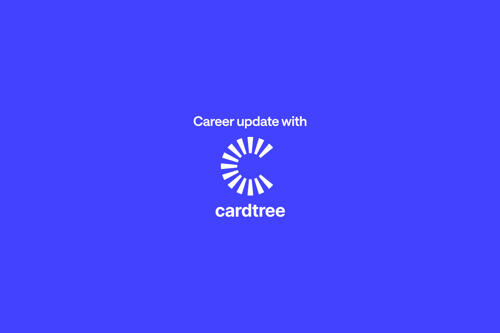
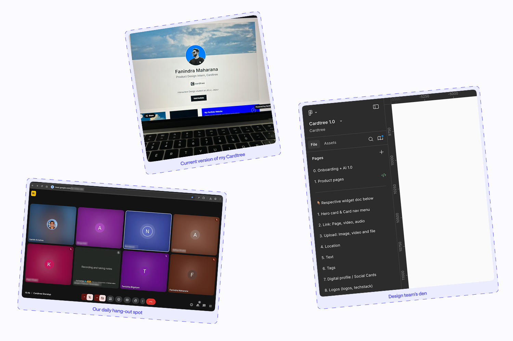

If you’ve been following me on LinkedIn, you probably already know that I recently joined **Cardtree** as a **Product Design Intern** and also took on some Product Management responsibilities.

After years of freelancing and working with clients, I felt it was time to gain some structured experience and strengthen my CV. So around mid-June, I started applying to companies.

The process wasn’t easy. I reached out to many designers and companies but mostly received rejections or silence. It was disheartening, especially since I’ve been practicing design consistently for almost three years and pursuing my M.Des for the last year. Even though client work was financially stable, it never gave me the depth of experience I was looking for. During our summer break, internships weren’t mandatory, but I felt it would be the right step for my career. That’s when I came across Cardtree.

### Discovering Cardtree

What caught my attention was how unique the product is for the Indian startup space. While most companies here are into e-commerce, ride-sharing, fintech, or edtech, Cardtree stood out as a **profile builder (like Linktree or Bento)** built from India. I really admired Sahith (the founder) for bringing this idea to life.

I applied, hoping for the best, and soon got a message from Sahith to schedule a call. What was supposed to be a 30-minute interview turned into a two-hour conversation. We discussed my work, my process, and one of my projects in detail. It felt like a great fit for both sides, and the next thing I knew, I was officially starting at Cardtree on **July 14th.**

### The Experience So Far

It’s been over a month now, and I can say this has been one of the most exciting parts of my journey so far. Sahith’s passion and involvement in the product are truly inspiring, it sets the tone for the entire team.

In this short time, I’ve:

- Designed **four new widgets** and refined the UX of an existing one.

- Worked closely with **Tanishqka** (my M. Des batchmate, who also joined Cardtree recently) on building a strong **brand identity.** Our debates on colors, styles, and directions always push us toward more balanced, unbiased solutions.

- Taken on **product management tasks**, from collaborating with developers to managing tasks on Jira and ensuring our designs translate well into the final product.

One important learning for me was adopting a **mobile-first design approach.** Initially, I focused on desktop-first, but since most of Cardtree’s users are on mobile, I quickly shifted my perspective and started prioritizing mobile experience.

> You can view my profile - [cardtr.ee/fanindra](https://cardtr.ee/fanindra)

### Looking Ahead

When I joined, Sahith told me that the current version of Cardtree was more of a working prototype that still needed refinement and polish. The goal is to shape it into something that truly aligns with today’s design standards and being part of that journey feels really rewarding.

My internship runs for four months, until end of November, and I’m excited to see how much more I’ll learn and grow during this time. So far, it has been a blend of design, management, and teamwork that’s pushing me to become better every day.